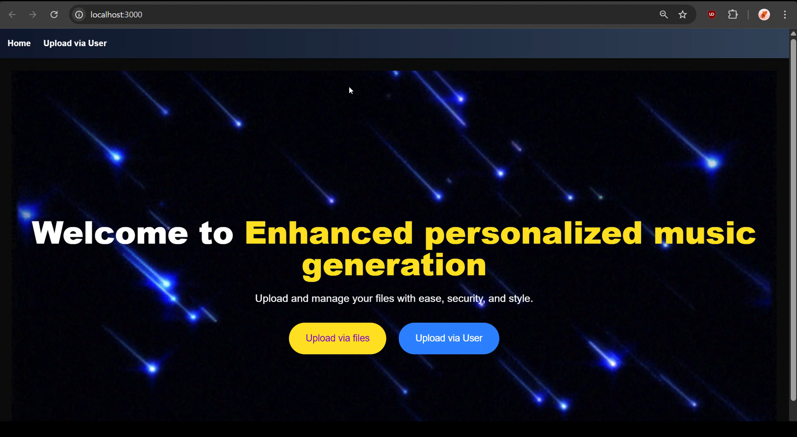

## Note 
**March 2025** 

This project was built in 16 hours during my third-year at a college hackathon - Epoch2.0 @ PES University. <br/>
## 🎯 Overview
AI-driven music generation system that analyzes Spotify playlists, extracts audio features and identifies instruments to create a short representative audio clips using MusicGen and Mixtral




## ✨ Features

- **Spotify Integration**: Upload songs via liked songs or public playlists
- **Instrument Detection**: AI-powered instrument identification using custom trained **Wav2Vec2** model
- **Audio Feature Analysis**: Extracts musical characteristics (energy, danceability, tempo, etc.)
- **Smart Prompting**: Uses Mixtral LLM to generate natural language prompts
- **Music Generation**: Creates representative audio clips using Facebook's MusicGen
- **Web Interface**: Next.js frontend with modern UI/UX

## 🏗️ Architecture

The system uses a multi-stage workflow:

1. **Data Collection**: Downloads audio from Spotify playlists via YouTube
2. **Feature Extraction**: Analyzes audio characteristics from Spotify's dataset
3. **Instrument Detection**: Uses `Bhaveen/epoch_musical_instruments_identification_2` model - [*link*](https://huggingface.co/Bhaveen/epoch_musical_instruments_identification_2)
4. **Statistical Analysis**: Computes statistics from playlist features using weighted average
5. **Prompt Generation**: Creates natural language descriptions with Mixtral-8x7b-32768
6. **Music Synthesis**: Generates audio with MusicGen using the generated prompt

## 📁 Project Structure


```
nextjs-audio-upload1/
├── app/                          # Next.js frontend
│   ├── api/upload/              # File upload API
│   ├── upload/                  # Manual file upload page
│   ├── user/                    # Spotify integration page
│   └── page.js                  # Landing page
├── public/uploads/              # Uploaded audio files
├── server.py                    # Flask backend server
├── orchestrator.py              # Main workflow orchestration
├── playlist.py                  # Spotify playlist handler
└── test_new.py                  # Liked songs handler
```

## Setup

### Prerequisites

- Node.js and npm
- Python 3.8+
- Spotify Developer Account
- CUDA-compatible GPU (recommended)

### Installation

1. **Clone the repository**
   ```bash
   git clone https://github.com/Bhav-Hub/Epoch2.0-Music-Generator.git
   cd nextjs-audio-upload1
   ```

2. **Install Python dependencies**
   ```bash
   pip install -r requirements.txt

   ```

3. **Install Node.js dependencies**
   ```bash
   npm install
   ```

4. **Environment Setup**
   Create a `.env` file with:
   ```env
   SPOTIFY_CLIENT_ID=your_spotify_client_id
   SPOTIFY_CLIENT_SECRET=your_spotify_client_secret
   SPOTIFY_REDIRECT_URL=http://localhost:8888/callback
   GROQ_API_KEY=your_groq_api_key
   ```

5. **Spotify App Configuration**
   - Create a Spotify app at [Spotify Developer Dashboard](https://developer.spotify.com)
   - Add `http://localhost:8888/callback` to redirect URIs
   - Copy Client ID and Secret to `.env`

## 🎮 How to Use

### Start the Application

1. **Start the Flask backend**
   ```bash
   python server.py
   ```

2. **Start the Next.js frontend**
   ```bash
   npm run dev
   ```

3. **Access the application**
   Open [http://localhost:3000](http://localhost:3000)

### Upload Methods

#### Method 1: Manual File Upload
- Navigate to Upload via files
- Click "Upload" then "Invoke"

#### Method 2: Spotify Integration
- Navigate to Upload via User
- **Liked Songs**: Click "Upload Liked Songs" for automatic Spotify authentication
- **Playlist**: Enter a Spotify playlist URL and click "Upload Playlist"
- Click "Invoke" to start processing

### Processing Workflow

The system follows this workflow defined in `orchestrator.py`:

1. **Audio Analysis**: Each uploaded file is processed by `llm_call` for instrument detection
2. **Feature Synthesis**: `synthesizer` aggregates results and computes statistics
3. **Prompt Generation**: `prompt_generator` creates natural language descriptions
4. **Music Generation**: `music_generator` produces the final audio clip

## API Endpoints

- `POST /api/upload` - Upload MP3 files
- `POST /run-script` - Clear uploads and run liked songs script
- `POST /playlist` - Process Spotify playlist URL
- `POST /invoke` - Start the music generation workflow
- `GET /musicgen_out.wav` - Download generated audio

## Technical Details

### Models Used

- **Instrument Detection**: Custom model `Bhaveen/epoch_musical_instruments_identification_2`
- **Language Model**: Mixtral-8x7B via Groq API
- **Music Generation**: Facebook MusicGen (Small variant)

### Audio Processing

- Sample rate: 16kHz
- Max length: 48,000 samples (3 seconds)
- Output format: WAV

### Feature Analysis

The system analyzes these Spotify audio features:
- Danceability, Energy, Valence
- Acousticness, Instrumentalness, Liveness
- Tempo, Key, Mode, Loudness, Speechiness

## File Descriptions

- **`server.py`**: Flask backend handling API requests and workflow coordination
- **`orchestrator.py`**: Core workflow using LangGraph for state management and processing pipeline
- **`playlist.py`**: Handles Spotify playlist authentication and audio downloading
- **`test_new.py`**: Manages Spotify liked songs processing
- **`app/user/page.js`**: React component for Spotify integration UI
- **`app/upload/page.js`**: React component for manual file upload


## Troubleshooting

- **CUDA Issues**: Ensure PyTorch is installed with CUDA support for GPU acceleration
- **Spotify Auth**: Verify redirect URI matches exactly in Spotify app settings
- **Audio Not Generated**: Check that MusicGen model downloads successfully and has sufficient disk space
- **Upload Failures**: Ensure MP3 files match track IDs in the Spotify dataset
